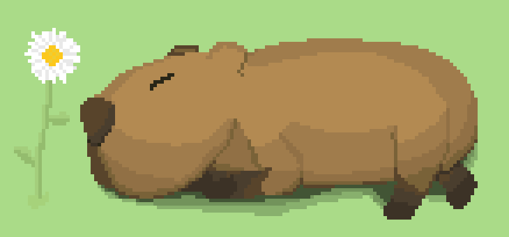

<h1 align="center">SirMaku – A university student aspiring to become a coder.</h1>

  

---

<h1 align="center">👨‍💻 Giới thiệu về tôi</h1>

- 🌏 Đến từ Việt Nam 
- 🎒 Hiện tại tôi đang học tại Học Viện Công Nghệ Bưu Chính Viễn Thông Cơ Sở tại TP.HCM
- 📌 Đam mê lập trình và công nghệ từ sớm
- 💬 Có thể trao đổi bằng tiếng Việt & English
- 💡 Mục tiêu của tôi: Trở thành một lập trình viên Full-Stack, có thể tự tay xây dựng những sản phẩm sáng tạo và hữu ích cho tôi và công việc.
  
---

<h1 align="center">🛠️ Bộ Công Cụ Lập Trình Của Tôi</h1>

<h3 align="center">💻 Programming Languages</h3>

  

<h3 align="center">🌐 Web Development</h3>

  

<h3 align="center">🎮 Game Development</h3>

  

<h3 align="center">🧰 Development Tools</h3>

  

<h3 align="center">🗃️ Data Management</h3>

  

<h3 align="center">🖥️ Operating Systems</h3>

  

<em>Học nhiều thứ, nhưng mới chỉ chạm tới bề mặt (chắc vậy) – vẫn đang trên hành trình khám phá sâu hơn mỗi ngày 🌱 (chắc thế)</em>

---

<h1 align="center"> 💬 Liên Hệ </h1>

